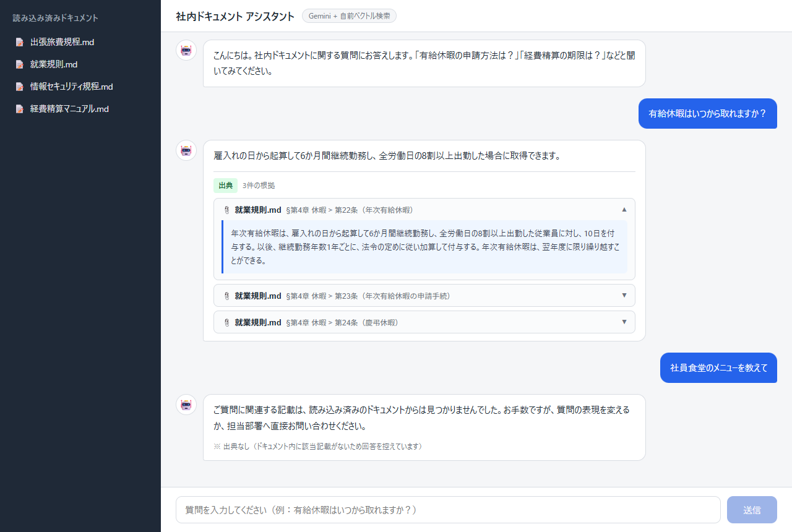
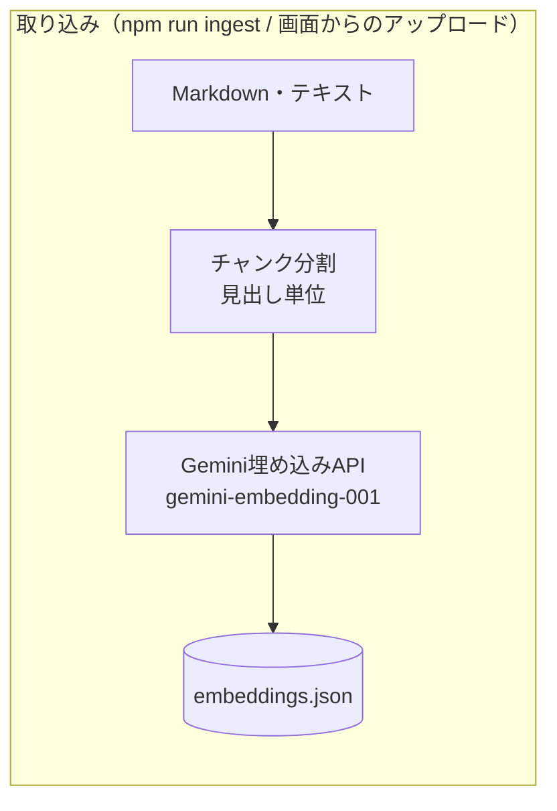
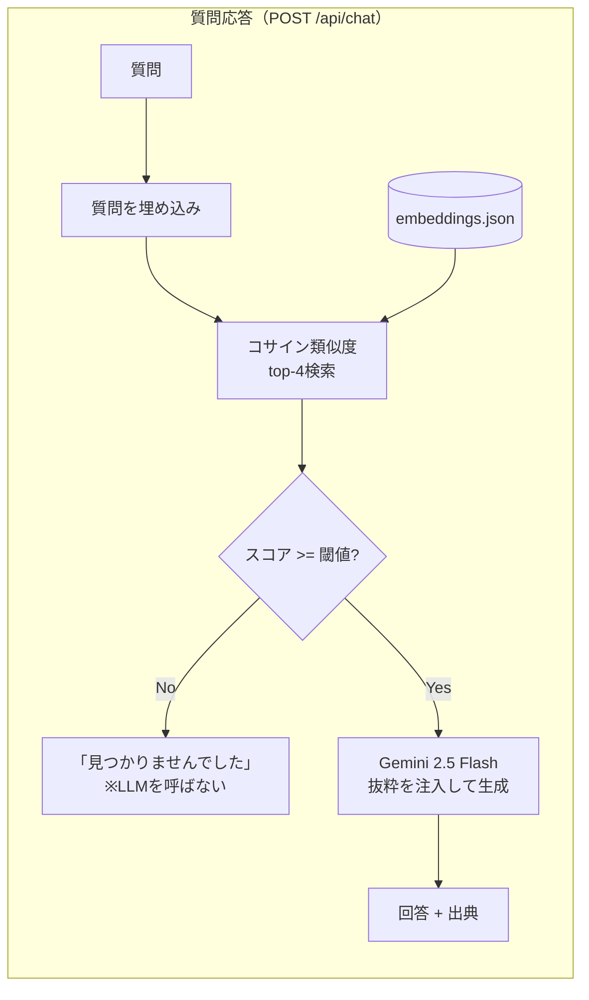

# 社内ドキュメントRAGチャットボット

社内規程（就業規則・経費精算マニュアルなど）に対して自然言語で質問すると、**該当箇所を出典付きで回答する** RAG（Retrieval-Augmented Generation）チャットボットです。



- 回答の下に必ず「出典」（文書名・セクション・抜粋）を表示し、根拠を確認できる
- 関連する記載が見つからない質問には、推測せず「見つかりませんでした」と正直に回答する（ハルシネーション対策）
- **画面から文書をアップロード**すると、その場でチャンク分割・埋め込みを行い、再起動なしで検索対象になる（Markdown / テキスト対応）。アップロードした文書は一覧のゴミ箱ボタンから削除できる（同梱のサンプル規程は保護され削除不可）
- **運用コストゼロ円**: LLM・埋め込みとも Google Gemini API の無料枠のみで動作

## アーキテクチャ



文書の取り込みは2経路あります。初期文書は CLI（`npm run ingest`）で一括取り込みし、運用中の追加は画面の「＋ドキュメントを追加」から `POST /api/documents` 経由で行います。どちらも同じチャンク分割・埋め込み処理を通り、アップロードした文書はメモリ上のベクトルストアにも即時反映されるためサーバー再起動は不要です。



| 層 | 技術 |
|---|---|
| フロントエンド | React 19 + TypeScript + Vite |
| バックエンド | Node.js + Express + TypeScript |
| LLM / 埋め込み | Google Gemini API 無料枠（gemini-2.5-flash / gemini-embedding-001） |
| ベクトル検索 | **自前実装**（JSONファイル永続化 + コサイン類似度の全件走査） |

## 設計のポイント

### なぜベクトルDBを使わず自前実装なのか

本アプリの検索対象は数十チャンク規模であり、全件走査（O(n)の内積計算）でも1ミリ秒未満で応答できます。この規模でベクトルDBを導入するのは過剰と判断し、「埋め込みをJSONに永続化し、コサイン類似度を自分で計算する」最小構成にしました。依存が減るぶんセットアップも `npm install` だけで済みます。数万チャンク規模に育てる場合は pgvector 等への移行を想定しています（`vectorStore.ts` にインターフェースを分離済み）。

なお、全ベクトルは保存前に L2 正規化しているため、コサイン類似度の計算は単純な内積で済みます。

### 検索段階のガードレール（ハルシネーション対策）

質問と最も近いチャンクのスコアが閾値未満の場合、**LLMを呼び出す前に**「見つかりませんでした」を返します。これには2つの狙いがあります。

1. 根拠のない質問に対してLLMがもっともらしい嘘を生成する余地をなくす
2. 無駄なLLM呼び出しを削減し、無料枠のレート制限を節約する

閾値はデバッグCLI（`npm run search -- "質問文"`）で関連質問・無関係質問のスコア分布を実測して決定しています。

### チャンク分割は「条文単位」

規程文書は「第N条」ごとに意味が完結するため、固定長分割ではなく **Markdownの見出し構造をそのままチャンク境界** にしています。見出しパス（例: `第4章 休暇 > 第22条（年次有給休暇）`）をメタデータとして保持し、そのまま出典表示に使います。埋め込み時はチャンク本文の先頭に見出しパスを付与し、条文番号などでの検索精度を高めています。

また、埋め込みAPIの `taskType` を文書側 `RETRIEVAL_DOCUMENT` / 質問側 `RETRIEVAL_QUERY` と使い分け、非対称検索に最適化された埋め込みを利用しています。

### 出典の粒度を「ページ」から「セクション」に再定義

当初のUIプロトタイプでは出典に「p.4」のようなページ番号を表示していましたが、Markdown文書に物理ページは存在しません。実装にあたり、出典の粒度を「セクション見出し」に再定義しました（`§第4章 休暇 > 第22条（年次有給休暇）`）。PDFの取り込みに対応する際は、ここをページ番号に戻せるよう `Source` 型を共有定義（`shared/types.ts`）に分離しています。

## セットアップ

前提: Node.js 20以上

```bash
# 1. APIキーの取得（無料・クレジットカード不要）
#    https://aistudio.google.com/apikey で「APIキーを作成」

# 2. バックエンド
cd backend
cp .env.example .env      # .env の GEMINI_API_KEY に取得したキーを設定
npm install
npm run dev               # http://localhost:3100

# 3. フロントエンド（別ターミナル）
cd frontend
npm install
npm run dev               # http://localhost:5188 がブラウザで開く
```

埋め込みデータ（`backend/data/embeddings.json`）はコミット済みのため、そのまま起動できます。文書（`backend/docs/*.md`）を編集した場合は `npm run ingest` で再生成してください（`--dry-run` でチャンク分割結果のみ確認可能）。

### Windowsでのかんたん起動

初回だけ上記の `npm install` と `.env` 設定を済ませれば、以降は **`起動.bat` をダブルクリック**するだけで、バックエンドとフロントエンドが起動し、準備完了後にブラウザで http://localhost:5188 が自動で開きます。終了するときは、開いた2つの黒いウィンドウ（backend / frontend）を閉じてください。

## 動作確認に使える質問例

- 「有給休暇はいつから取れますか？」 → 就業規則 第22条・第23条を出典に回答
- 「経費精算の期限は？」 → 経費精算マニュアル 1-1 を出典に回答
- 「パスワードのルールを教えて」 → 情報セキュリティ規程 第5条を出典に回答
- 「今日の天気は？」 → 「関連する記載が見つかりませんでした」（ガードレール動作）

## 無料枠とレート制限について

Google AI Studio のAPIキーは課金登録なしで利用でき、無料枠を超えた場合は 429 エラーになるだけで**請求は発生しません**。本アプリでは次の対策を入れています。

- インジェスト時: 埋め込みAPIを1件ずつ700ms間隔で呼び出し、429時は指数バックオフで再試行
- アップロード時: 429時はバックエンドで1回だけ再試行。文書サイズ・チャンク数に上限を設けて過剰な呼び出しを防止
- チャット時: 429時はバックエンドで1回だけ再試行し、それでも失敗した場合はフロントに「1分ほど待ってから再送信してください」と案内

## 制約と今後の展望

- **PDF・Word対応**: 現在の取り込みは Markdown / テキストのみ。PDF取り込み（ページ番号付き出典）は `Source` 型の `section` を拡張して対応予定
- **ストリーミング応答**: 現在は回答完成後に一括表示。SSEでの逐次表示に対応したい
- **リランキング**: ベクトル検索のtop-kをそのまま使っており、クロスエンコーダ等での並べ替えは未実装
- **マルチターン会話**: 会話履歴を考慮した質問の言い換え（query rewriting）は未実装
- **アクセス制御**: 現在は認証なし（ローカル単一利用者のため）。本番展開時は「閲覧・質問は全社員、文書の追加・削除は管理者のみ」というロール分離を想定（単一テナントなら管理者トークン、組織展開なら社内SSO連携）

## 免責

`backend/docs/` の規程類はポートフォリオ用に作成した架空の文書です。登場する「株式会社ミライテック」は実在しません。
